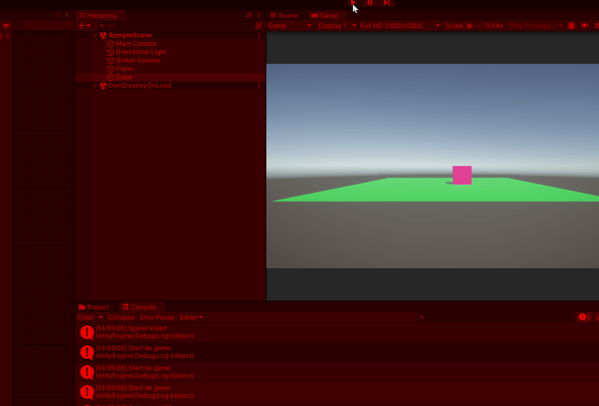
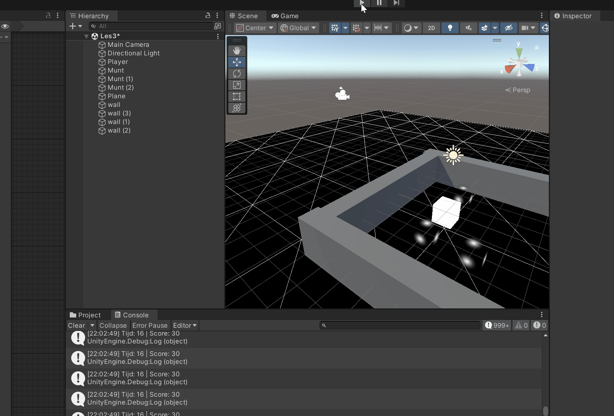
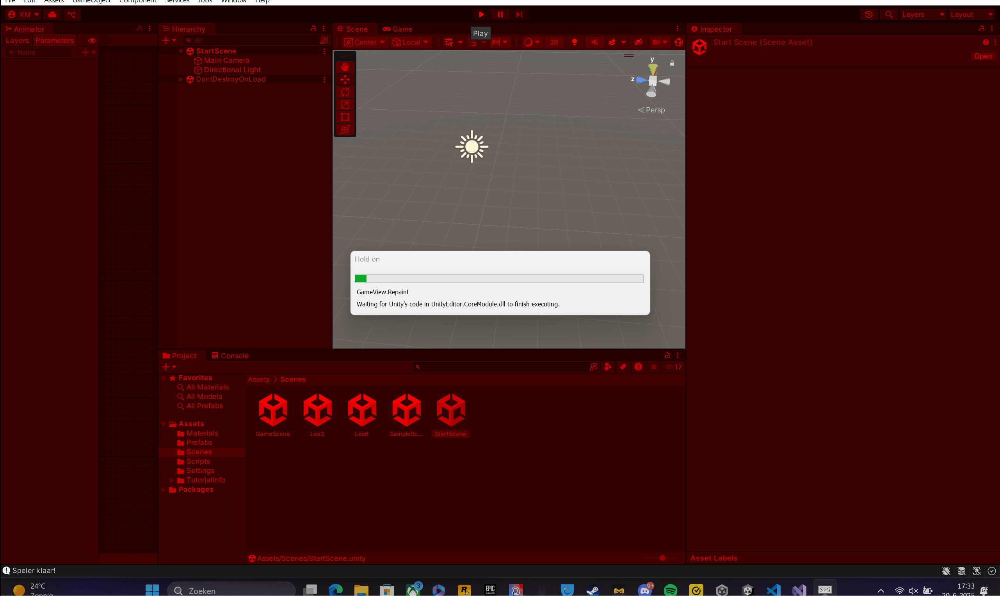
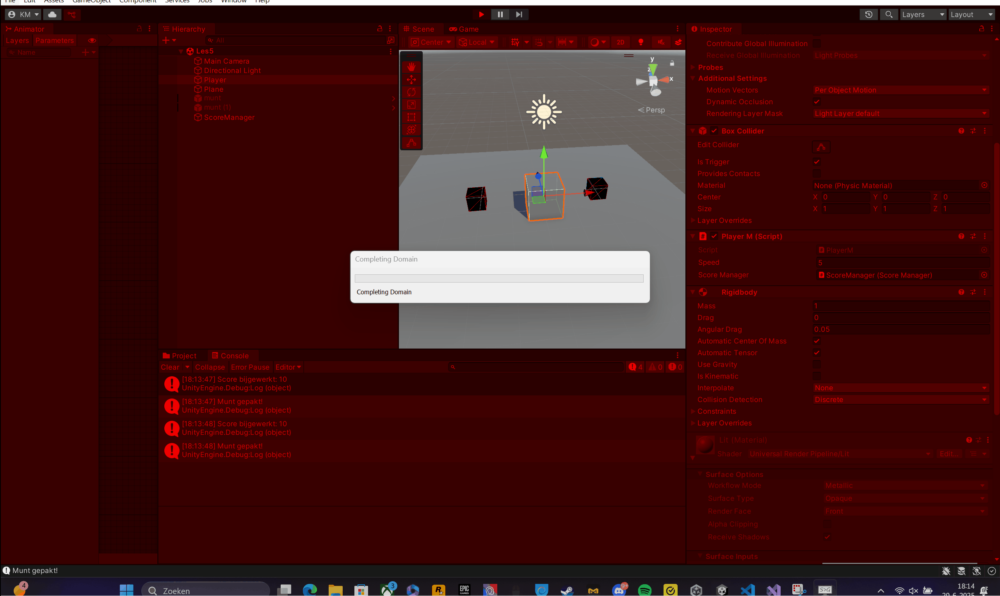

# les1

## gemaakt door Kevin Mei

script link https://github.com/BadTimeForU/M4-PROG/tree/main/Assets/Scripts

# les2

## gemaakt door Kevin Mei

script link https://github.com/BadTimeForU/M4-PROG/tree/main/Assets/Scripts

# les3

## gemaakt door Kevin Mei

script link [https://github.com/BadTimeForU/M4-PROG/tree/main/Assets/Scripts](https://github.com/BadTimeForU/M4-PROG/blob/main/Assets/Scripts/GameManager.cs)

# les4

## gemaakt door Kevin Mei

script link
https://github.com/BadTimeForU/M4-PROG/blob/main/Assets/Scripts/SceneSwitcher.cs

# les5

## gemaakt door Kevin Mei

script link
https://github.com/BadTimeForU/M4-PROG/blob/main/Assets/Scripts/PlayerM.cs
https://github.com/BadTimeForU/M4-PROG/blob/main/Assets/Scripts/ScoreManager.cs

# les6

## gemaakt door Kevin Mei

script link https://github.com/BadTimeForU/M4-PROG/blob/main/Assets/Scripts/PlayerMove.cs

https://github.com/BadTimeForU/M4-PROG/blob/main/Assets/Scripts/FollowAndReturn.cs

https://github.com/BadTimeForU/M4-PROG/blob/main/Assets/Scripts/MoveOverField.cs
